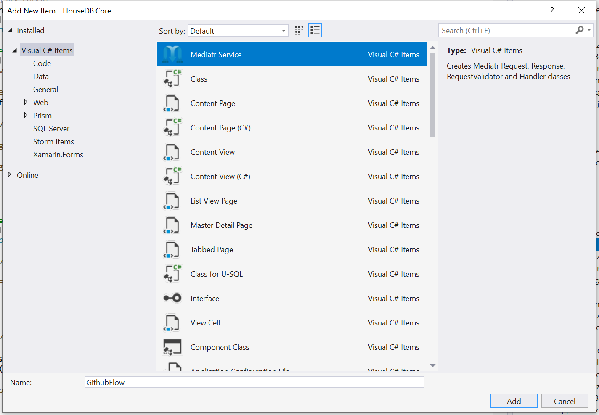
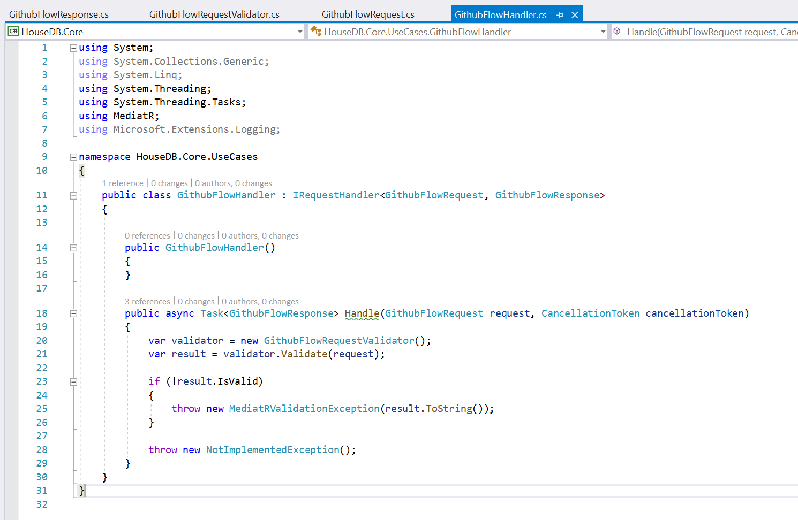

# MediatRTemplate (With thanks to [Jeffrey](https://github.com/ThumNet))
Visual Studio template for MediatR with FluentValidation

This template creates 4 files to implement an UserCase with MediatR and FluentValidation. The created files are:
- Handler
- Request
- RequestValidator
- Response

## Install
1. Place the contents of the directory 'VisualStudioTemplate' in a zip file and copy that zip file to '%userprofile%\Documents\Visual Studio %version%\Templates\ItemTemplates'
2. Restart Visual Studio
3. Under Add -> New Item there is the new template

## Printscreens
Adding new item

Generated classes
